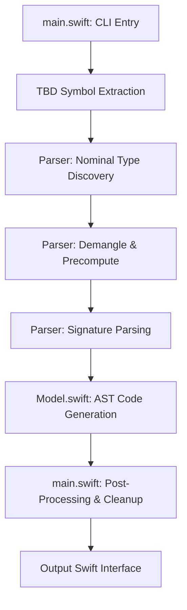

# SwiftInterfaceGen Source Code Architecture

This directory contains the source code for the `swift-interface-gen` tool. The generator is designed to dynamically reconstruct Swift module interfaces (`.swiftinterface` / `.swift`) and dynamic libraries from compiled macOS/iOS Text-Based Stub (`.tbd`) files.

## Directory Layout & File Roles

- **`main.swift`:** The CLI entry point. Coordinates CLI argument parsing, TBD scanning, symbol pre-computing/parsing, import resolution, dynamic stub module emission, and final code post-processing.
- **`Parser.swift`:** The parsing engine. Demangles ABI symbol strings, structures nominal type trees, identifies protocol conformances, pre-computes nested scopes, and parses member signatures (methods, properties, subscripts, typealiases).
- **`Model.swift`:** Defines the Abstract Syntax Tree (AST) components (like `TypeNode` and `Member`) and handles code generation (reconstructing code blocks into compilable Swift files).
- **`Config.swift`:** Manages global tool configurations, target SDK roots, and system path resolutions.
- **`String+RegexFree.swift`:** Helper extensions for string manipulation, keyword shielding, and regex-free text formatting.

---

## Generator Pipeline Overview

When the tool runs, it executes the following sequential pipeline:



### 1. Symbol Extraction & Re-exports
* The tool parses the `.tbd` stub file, extracting all mangled Swift ABI symbols (starting with `_$s`) and Objective-C classes (starting with `_OBJC_CLASS_$_`).
* It extracts any re-exported libraries listed in the TBD and recursively parses their symbols into the parser instance (depth > 0).

### 2. Nominal Type Discovery (ABI Scanning)
* The parser scans demangled strings to identify nominal types (classes, structs, protocols, enums).
* It registers them in the `discoveredConcreteTypes` and `discoveredProtocols` collections. This early discovery is critical for classifying types during signature parsing and applying `any` existential prefixes.

### 3. Pre-computation Phase
* The parser builds the target module's AST namespace. Nested scopes are resolved recursively by splitting paths (e.g. `A.B.C` matches struct `C` nested in struct `B` inside struct `A`).

### 4. Signature Parsing
* The parser runs regex patterns against each demangled symbol to extract:
  * **Properties:** Names, types, getters/setters, static vs. instance.
  * **Initializers/Methods:** Parameter names, types, escape attributes, generic requirements, return types.
  * **Enums:** Case names and associated payloads.
  * **Conformances:** Inherited protocol types.

### 5. AST Code Generation (`Model.swift`)
* The AST is traversed to output Swift code:
  * Classes and structs are emitted with member properties, initializers (using `dummyDefaultValue()` defaults), and functions.
  * Protocols are generated with their properties, requirements, and associated types.
  * Enums are emitted with case declarations and conformance stubs.

### 6. Post-Processing (`main.swift`)
* Cleans up redundant module prefixes.
* Resolves standard type collisions (e.g. shielding `Swift.Int`, `Swift.Double`, etc. if overridden).
* Strips redundant generic markers and applies operator fixes.

---

## AST Design (`Model.swift`)

The AST is represented by a tree of `TypeNode` structures:

```swift
class TypeNode {
    var name: String                // Name of the type (e.g. "CatalogClient")
    var kind: String                // "class" | "struct" | "enum" | "protocol"
    var baseClass: String?          // Parent class name
    var conformances: Set<String>   // Protocols implemented by this type
    var genericParams: [String]     // Generic parameters (e.g. ["T", "U"])
    
    var nestedTypes: [String: TypeNode]  // Nested type declarations
    var members: [String: Member]        // Properties, enums cases, methods, subscripts
}
```

Members are categorized by the `Member` enum:

```swift
enum Member {
    case property(name: String, type: String, isReadOnly: Bool, isStatic: Bool)
    case initializer(signature: String)
    case method(name: String, signature: String, isStatic: Bool)
    case enumCase(name: String, payload: String?)
    case subscriptDecl(signature: String)
    case associatedType(decl: String)
}
```

---

## Code Generation & Self-Alignment Stubs

When target libraries are compiled, missing symbols (such as compiler-generated metadata accessors or inlined functions) will fail to resolve. To bridge this:
1. **Dynamic library mapping:** The orchestrator compiles the Dynamic library twice. The first pass maps compiler-accessible definitions.
2. **Assembly stub injection:** The comparison tool compares exports and generates `stubs_{name}.s`.
3. **Clang assembly compilation:** The assembly stubs are compiled to `stubs_{name}.o` using `clang` and linked directly via `-Xlinker stubs_{name}.o` with `-exported_symbols_list` during the second dynamic compilation pass, achieving 100% symbol layout matching.
